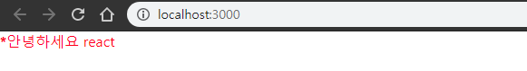
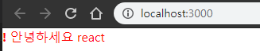

## 0407 Daily-Study

[TOC]

------


### 작성시 code의 규칙

1. 태그는 무조건 닫혀 있어야 한다. -> input, br태그 같은 경우 (self closing) /을 사용
2. 2개 이상의 태그는 하나의 태그로 감싸져야 한다. <></>  비어 있는 태그
3. JavaScript의 값을 사용시 {name} 을 사용
4. class 태그는 className으로 사용한다
5. 주석은 {/* */} , // 사용한다

------


### Props, defaultProps

> **컴포넌트 사용시 특정 값을 보내주기 위해서 사용한다**


App.js

```jsx
import React from 'react';
import Hello from './Hello.js';

function App() {
  return (
    <div> 
      <Hello name="react" color="red"/>  // Hello.js에게 name값과 color값을 전달
    </div>
  );
}

export default App;

```


Hello.js

```jsx
import React from 'react';

 function Hello({ color, name}) {  // App.js에서 받음 props를 파라미터로 받아온다
     return  (
     <div style={{color
    }}>
    안녕하세요 {name}
    </div>
    );
 }

 Hello.defaultProps = { // 디폴트 값을 설정하여 name값이 정해지지 않은 경우엔 이름없음이 출력된다.
     name : '이름없음'
 };

 export default Hello;
```


------


### 조건부 렌더링

- 보여줘여하는 값을 숨길 때 and연산자
- 값을 보여줘야 할 때 : 삼항연산자를 사용한다 


App.js 

```jsx
import React from 'react';
import Hello from './Hello.js';

function App() {
  return (
    <div>
      <Hello name="react" color="red" isSpecial={true} />  
    </div> 
  );
}

export default App;

```


Hello.js // 3항연산자 사용

```jsx
import React from 'react';

 function Hello({ color, name , isSpecial}) {  // props를 파라미터로 받아온다
     return  (
     <div style={{color
    }}>
        {isSpecial ? <b>*</b> : null}  
             {/* isSpecial의 값이 참이면 *찍고 아니면 널값을 보여줘라 3항연산자 사용  */}
    안녕하세요 {name}
    </div>
    );
 }

 Hello.defaultProps = { // 디폴트 값을 설정하여 name값이 정해지지 않은 경우엔 이름없음이 출력된다.
     name : 'stranger'
 };

 export default Hello;
```


결과




Hello.js // && 연산자 사용

```jsx
import React from 'react';

 function Hello({ color, name , isSpecial}) {  // props를 파라미터로 받아온다
     return  (
     <div style={{color
    }}>
        {isSpecial && <b>!</b>}  
             {/* isSpecial의 앤드 연산자를 사용하여 무조건 뒤에 있는 ! 가져와 결과를 보여준다  */}
    안녕하세요 {name}
    </div>
    );
 }

 Hello.defaultProps = { // 디폴트 값을 설정하여 name값이 정해지지 않은 경우엔 이름없음이 출력된다.
     name : 'stranger'
 };

 export default Hello;
```

결과

