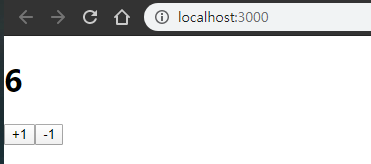

## 0408 Daily-Study

[TOC]

------


### useState

> 동적인 상태 관리를 위한 useState 함수 사용입니다.
>
> react 16.8 버전에서 hooks라는 기능이 도입
>
>  함수형 컴포넌트에서도 상태를 관리 할 수 있게 되었습니다.
>
> react hooks의 하나인 useState를 통한 버튼을 클릭하면 숫자가 변하는 코드를 작성


Counter.js

```jsx
import React, {useState} from 'react'; 
// useState 함수를 사용하겠다는 선언 


function Counter(){
    const [number,setNumber] = useState(0); 
    // useState를 사용하여 새로운 state를 생성한 후 초기 값을 0으로 설정합니다.

    const onIncrease = () => {
        setNumber(prevNumber => prevNumber + 1); 
        {/* 값을 가져옵니다 , 클릭시 현재 값은 현재 값에 + 1*/}
    };

    const onDecrease = () => {
        setNumber(prevNumber => prevNumber - 1) 
        {/* 값을 가져옵니다 , 클릭시 현재 값은 현재 값에 -1 1*/}
    };

    return(
      <div>
          <h1>{number}</h1> 
          <button onClick={onIncrease}>+1</button> 
            {/*일반 자바스크립트에선 onclick="function()" 이런식으로 작성했지만 react와			는 문법이 약간 다릅니다*/}
          <button onClick={onDecrease}>-1</button>
      </div>
    )    
}

export default Counter;
```


App.js

```jsx
import React from 'react';
import Counter from './Counter.js';

function App() {
  return (
    <Counter />
  );
}

export default App;

```


결과



+1을 클릭시 숫자가 올라가고

-1을 클릭시 숫자가 내려가는것을 확인 할 수 있습니다.


------


### Input 상태 관리

> 버튼 말고 react에서 input 상태를 관리 하는 방법입니다. 


InputSample.js

```jsx
import React,{useState} from 'react'; // 상태 값 변경을 위한 useState 사용

function InputSample() {
    const [text,setText] = useState('');
    // useState를 사용하여 새로운 state를 생성한 후 초기 값을 널 값으로 설정합니다.

    const onChange = (e) => { // 함수 생성
        setText(e.target.value); 
    };

    const onReset = () => { // 이 함수는 setText가 널값으로 바꾸어 초기화하게 만드는 값
        setText('');
    };

    return(
        <div>
            <input onChange={onChange} value={text} /> 
            <button onClick={onReset}>초기화</button>
            <div>
                <b>값 : </b>
                {text}
            </div>
        </div>
    );
}

export default InputSample;
```


App.js

```jsx
import React from 'react';
import InputSample from './InputSample';

function App() {
  return (
    <InputSample />
  );
}

export default App;
```


결과


------

